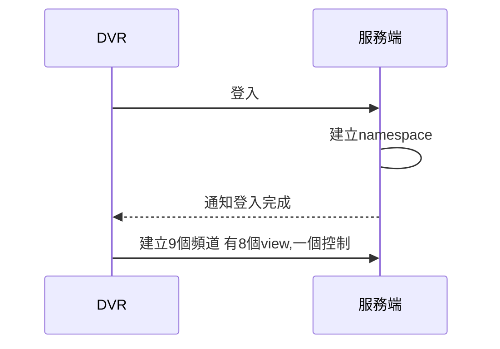

### DVRClient

加入`socket.io`

```
npm install socket.io --save
```

加人dashboard的模組

```
ng g m dashboard --routing 
```

加人dashboard的元件

```
ng g c dashboard 
```

### 安裝@angular/material和@angular/cdk

```
npm install --save @angular/material @angular/cdk
```

### 安裝@angular/animations

```
npm install --save @angular/animations
```
加入SharedAngularMaterial <https://ithelp.ithome.com.tw/articles/10209937>

```
ng g m share\SharedAngularMaterial
```

#### 如果是動態載人

在**SharedAngularMaterialModule**中要將BrowserAnimationsModule是從**AppModule**來載人不是從**SharedAngularMaterialModule**來載人在`src\app\app.module.ts`中

```typescript
imports: [
    BrowserModule,
    BrowserAnimationsModule,
    FormsModule,
    AppRoutingModule,
  ],
```

### 加入theme設定

在'styles.scss'中

```scss
@import "~@angular/material/prebuilt-themes/purple-green.css";
```

### 加入Material Icons

可以到此網站找到需要的Icon,[Material Icons](https://material.io/icons/)

在'index.html'

```html
<link href="https://fonts.googleapis.com/icon?family=Material+Icons" rel="stylesheet">
```

#### 在MatIcon中使用SVG

必須透過Angular提供的DomSanitizer Service來信任這個路徑。接著我們就可以透過`MatIconRegistry`來擴充SVG icon

```typescript
export class SharedAngularMaterialModule implements OnInit {
  constructor(private matIconRegistry: MatIconRegistry, private domSanitizer: DomSanitizer) {
    this.ngOnInit();
  }
  ngOnInit(): void {
    // this.matIconRegistry.addSvgIconInNamespace(
    //   "custom-svg",
    //   "angular",
    //   this.domSanitizer.bypassSecurityTrustResourceUrl("assets/images/angular_solidBlack.svg")
    // );
  }
```

#### 在MatIcon中使用Icon Font

以FontAwesome為例，我們先來安裝庫

```
npm install --save @fortawesome/fontawesome-free
```

接下來在`src\styles.scss`中

```scss
@import "~@angular/material/prebuilt-themes/purple-green.css";
@import "~@fortawesome/fontawesome-free/css/all.css";
```

### 打造基本後台

在`src\app\dashboard\dashboard.component.html`

```html
<mat-sidenav-container>
  <mat-sidenav #sideNav (opened)="opened()" (closed)="closed()">我是左邊選單
    <div>
      <button mat-raised-button color="warn" (click)="toggleSideNav(sideNav)">切換選單</button>
    </div>
  </mat-sidenav>
  <mat-sidenav-content>
    <button mat-button (click)="toggleSideNav(sideNav)">切換左邊選單</button>
    <div style="background-color: red;height: 200px; ">

    </div>
    <router-outlet></router-outlet>
  </mat-sidenav-content>
</mat-sidenav-container>
```

在`src\app\dashboard\dashboard.component.ts`

```typescript
import { Component, OnInit } from '@angular/core';
import { MatSidenav, MatDrawerToggleResult } from '@angular/material/sidenav';

@Component({
  selector: 'app-dashboard',
  templateUrl: './dashboard.component.html',
  styleUrls: ['./dashboard.component.scss']
})
export class DashboardComponent implements OnInit {

  constructor() { }

  ngOnInit() {
  }
  toggleSideNav(sideNav: MatSidenav) {
    sideNav.toggle().then((result: MatDrawerToggleResult) => {
      console.log(result);
      console.log(`選單狀態:${result}`);
    });

  }
  opened() {
    console.log("芝麻開門");
  }
  closed() {
    console.log("芝麻關門");
  }
}
```

#### 開始使用Angular Material中的Toolbar

在加入ToolBar有點小小問題，會隨著畫面捲動要讓toolbar個定在最上方設定一下CSS就好了在`src\app\dashboard\dashboard.component.scss`

```scss
mat-sidenav-container{
    width: 100%;
  }
  .demo-app-header {
      position: fixed;
      top: 0;
      z-index: 2;
    }
    
    .demo-app-container,
    .demo-app-sidenav {
      position: absolute;
      padding-top: 64px;
      //width: 100%;
   }
  .toolbar-seprator{
    flex:1 1 auto;
  }
```

在`src\app\dashboard\dashboard.component.html`中加入Toolbar

```html
<mat-toolbar class="demo-app-header" color="primary">
  <button mat-icon-button (click)="sideNav.toggle()">
    <mat-icon>{{sideNav.opened ? 'close':'menu'}}</mat-icon>
  </button>
  <span>多頻道demo</span>
  <!-- 在這之後的都會被推到右邊去 -->
  <span class="toolbar-seprator"></span>
  <button mat-icon-button>
    <mat-icon>message</mat-icon>
  </button>
  <button mat-icon-button>
    <mat-icon>exit_to_app</mat-icon>
  </button>

</mat-toolbar>
```

#### 開始使用Angular Material的List元件

在`src\app\dashboard\dashboard.component.html`中加入

```html
<mat-nav-list>
  <h3 matSubheader>示範用頁面</h3>
  <a [routerLink]="['/', 'dashboard', 'survey']" mat-list-item>問卷調查</a>
  <a [routerLink]="['/', 'dashboard', 'blog']" mat-list-item>部落格</a>
  <a [routerLink]="['/', 'dashboard', 'inbox']" mat-list-item>收件夾</a>
  <mat-divider></mat-divider>
  <!-- 另外一組選單 -->
  <h3 matSubheader>其他頁面</h3>
  <a [routerLink]="['/']" mat-list-item>首頁</a>
  <a [routerLink]="['/']" mat-list-item>Google</a>
  <a [routerLink]="['/']" mat-list-item>Facebook</a>
</mat-nav-list>
```

### 加入login

```
ng g m carlogin --routing
ng g c carlogin
```

在`src\app\app-routing.module.ts`中修改如下

```typescript
const routes: Routes = [
  { path: '', redirectTo: 'dashboard', pathMatch: 'full' },
  { path: 'dashboard', loadChildren: "./dashboard/dashboard.module#DashboardModule" },
  { path: 'login', loadChildren: "./login/login.module#LoginModule" },
  { path: '**', redirectTo: 'dashboard', pathMatch: 'full' }
];
```

### 加入通知訊息

```
ng g s services\toaster
```

```typescript
import { Injectable } from '@angular/core';
import { MatSnackBar } from '@angular/material/snack-bar';

@Injectable({
  providedIn: 'root'
})
export class ToasterService {

  constructor(private snackBar: MatSnackBar) { }
  showToaster(msg: string) {
    this.snackBar.open(msg, null, {
      duration: 2000,
    });
  }
}

```

### 加入`Auth Service`

```
npm install --save jwt-decode
ng g s services/auth
ng g s helper/jwt.interceptor
```

加入jwt.interceptor

```typescript
import { Injectable } from '@angular/core';
import { HttpRequest, HttpHandler, HttpEvent, HttpInterceptor } from '@angular/common/http';
import { Observable } from 'rxjs';
import { AuthService } from '../services/auth.service';

@Injectable()
export class JwtInterceptor implements HttpInterceptor {
  constructor(private authService: AuthService) { }
  intercept(request: HttpRequest<any>, next: HttpHandler): Observable<HttpEvent<any>> {
    // add authorization header with jwt token if available
    let currentCar = this.authService.currentCarValue;
    if (currentCar && currentCar.token) {
      request = request.clone({
        setHeaders: {
          authorization: `Bearer ${currentCar.token}`
        }
      });
    }
    return next.handle(request);
  }
}

```

### 建立服務端㳘程



#### 建立面板

```
ng g c dashboard\carPanel 
```

加入PySocketio的服務

```
ng g s services\PySocketio
```

加入CarRoom的元件

```
ng g c dashboard\carRoom
```

加入讀圖檔的服務

```
ng g s services\ImageFile
```

加入解碼相關
```
npm install --save jmuxer

```


###### 參考資料
[RxJS使用情境(3)- 利用 BehaviorSubject 來管理使用者登入狀態](https://blog.kevinyang.net/2017/02/26/rxjs-context-demo-3/)
