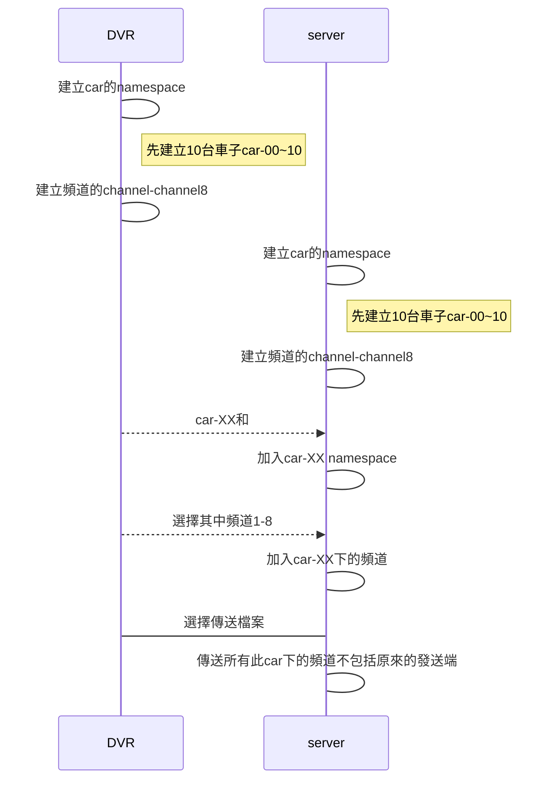

# TestGop3
1. 主要是測試200個連線在python的Flask-SocketIO是否有什麼issue
2. 主要測試可以傳送到多少的client

### Server端

使用python **Flask-SocketIO** 使用port=50001

### pytest

使用python的selenium來打開多個瀏覽器來測試同時傳送和發送資料

#### DVR

可同時扮演傳送和接收的角色，不顯示內容