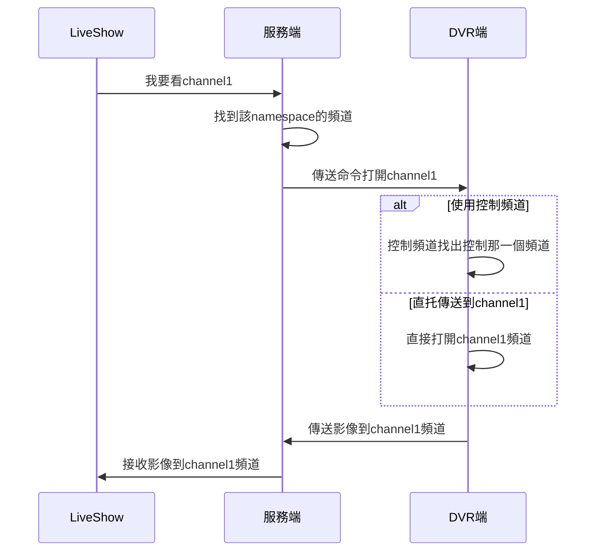

## 前言

這是為了測試在client端向server端要求時，server端會傳送client端需要的namespace，來讓client端來以websocket來連線，之後在DVR的模擬端會送連續圖片給server，收到之後轉給要求的client端

### DVRClient

專門傳送影像的client端

### LiveClient

是使用者操作的client端

### Server

是使用python來作為webapi

#### 控製DVR sequenceDiagram

